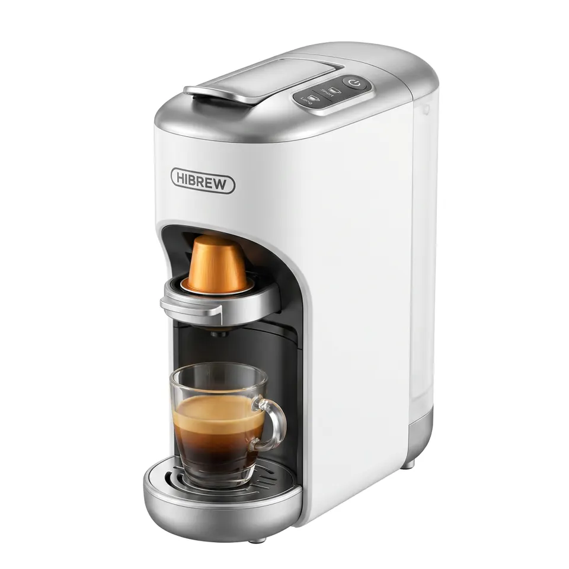

# 出海本地化

**模式**：文生视频 + 视频编辑 | **时长**：20s | **画幅**：9:16 竖屏

一条母版出多国版本。镜头和节奏不变，换人种、换语言、换文案，口型跟着语种走。

| 产品参考图 | 多语种口播成片 |
|---|---|
|  |  |

## 需要的素材

- `@图片1` — 产品图
- `@图片2` — 主播形象与场景图

## 第一步：生成中文母版

```text
@图片1 用于产品的外观、颜色和标签，不采用图片背景。
@图片2 用于主播的五官、发型、服装以及背景场景，直接沿用其构图关系。

主播在 @图片2 的场景中面向镜头讲解产品，
双手配合台词自然挥动，表情真实自然，口型与台词精确同步。

0-3s    固定镜头，中景。主播看着镜头说：{清晨第一杯咖啡，等不了。}
3-8s    主播右手按下产品开关，镜头略微推近到产品，
        说：{按一下，三秒出杯。}
8-14s   镜头回到中景，主播说：{办公室、出差、深夜赶稿，现磨咖啡随身就有。}
14-20s  主播双手捧起做好的咖啡，看向镜头，
        说：{打工人续命神器，限时直降。}
        最后一秒镜头轻微后拉，画面下方留出角标空间。

画面呈现明亮自然的室内光，产品细节清晰，背景轻微虚化。
声音：保留主播人声和产品运作的机械声，无背景音乐。
不要字幕，不要文字角标。
```

## 第二步：逐语种改写

```text
将 @视频1 中的人物换成美国女性，旁白与台词改成英语，
镜头、动作节奏、产品和背景保持不变。
```

```text
将 @视频1 中的人物换成西班牙男性，旁白与台词改成西班牙语，其余保持不变。
```

```text
将 @视频1 中的人物换成印度尼西亚女性，旁白与台词改成印尼语，其余保持不变。
```

```text
将 @视频1 中的人物换成马来西亚男性，旁白与台词改成马来语，其余保持不变。
```

## 只换语言不换人

不需要换人种时写法更短：

```text
将 @视频1 中声音、台词、旁白和标题字幕里的中文全部改为日语，其余保持一致。
```

口型会自动跟着语种对齐，不需要额外指定。

## 效果说明

一次拍摄覆盖全部目标市场。相比每个市场单独找模特拍摄，成本差了两个量级，而且各版本的运镜和节奏完全一致，投放数据可比性更好。

## 改法

- **控制口音**：目标市场有明显地区差异时，在编辑提示词里写清楚：
  ```
  台词语言：墨西哥西班牙语，不要西班牙本土口音。
  ```
- **换场景不换人**：`将 @视频1 的背景替换为 @图片3 的办公室场景，人物、动作和镜头保持不变`
- **加本地化文案**：`将画面下方的文字改为 "Limited time offer"，字体风格、位置和出现时机保持不变`

## 支持的语言

中文、英语、西班牙语、印尼语、马来语、泰语、阿拉伯语、葡萄牙语、越南语、日语、韩语等 10 余种。

写母版时也可以直接用目标语言写提示词，不需要先翻成中文。

## 相关

[声音与多语言](../../docs/05-audio-and-dialogue.md) · [SKU 批量换款](./sku-batch-swap.md)

在 [imya.ai](https://imya.ai/seedance-2-5) 直接试这条。
