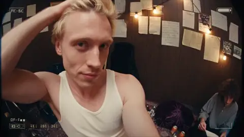
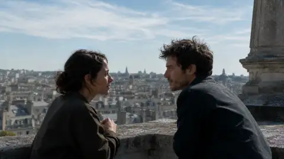

# 音频驱动卡点

**模式**：参考生成（只参考音频）| **时长**：30s | **画幅**：9:16 竖屏

2.5 新增的能力：只传一段音频，让画面跟着它走。剪辑点、动作起落和镜头切换全部对齐节拍，不需要后期卡点。

| 音乐驱动的 MV | 音频驱动的对白 |
|---|---|
|  |  |

## 需要的素材

- `@音频1` — BGM 或人声，单段 2–30 秒（所有音频加起来 ≤ 30 秒）

## 提示词

```text
@音频1 用于整片的节奏基准。
画面的剪辑点、人物动作的起落和镜头切换全部对齐 @音频1 的鼓点，
不采用音频中的任何人声内容作为台词。

内容：城市夜跑。一位穿深色运动服的跑者穿过五个场景，
每次场景切换都精确落在音乐的重拍上。

场景顺序：
便利店门口的白色灯光 → 地下通道的橙色顶灯 → 高架桥下的间隔光柱
→ 滨江步道的蓝色路灯 → 天台的城市全景

跑者全程保持同一套服装和体态，步频与音乐节拍一致。
每个场景内镜头做一次景别变化：跟拍中景推近到脚步特写，
或从侧面跟随拉开成远景。

画面呈现高对比的夜景质感，霓虹和路灯在湿滑路面上形成反射，
呼出的白气在冷光下可见，运动模糊自然。
主光源随场景变化，色温在冷暖之间交替。

声音：使用 @音频1 作为背景音乐。
保留脚步落地声和呼吸声，音量低于音乐。

不要字幕，不要慢动作，不要跑者停下，不要黑场转场。
```

## 效果说明

传统做法是先生成画面再手动对齐音乐，这条把顺序反过来了——音乐先定，画面跟着长。省掉的是后期最耗时的一步。

「不采用音频中的任何人声内容作为台词」这句要写。传的如果是带人声的歌，不写这句模型可能会让画面里的人跟着唱。

## 改法

- **换内容**：任何有明确节奏感的题材都行——产品展示、穿搭切换、美食制作、旅行 vlog
- **对齐人声而非鼓点**：`画面的情绪起伏对齐 @音频1 中人声的强弱变化，副歌部分画面节奏加快`
- **口型对齐**：传人声音频时可以做口型同步：
  ```
  @音频1 用于人物的台词内容和音色，人物口型与 @音频1 精确对齐。
  ```
- **加视觉锚点**：让某个物件贯穿全片，比转场更能串起来：
  ```
  跑者手腕上的荧光手环在每个场景中都可见，作为视觉连续性的锚点。
  ```

## 音频素材的限制

| 项目 | 上限 |
|---|---|
| 数量 | 最多 10 段 |
| 单个大小 | ≤ 15MB |
| 格式 | mp3、wav |
| 单段时长 | 2–30 秒 |
| 总时长 | ≤ 30 秒 |

音频总时长和视频总时长**分开计算**，各有 30 秒额度，不互相挤占。详见 [能力与硬参数](../../docs/01-capabilities.md#参考素材上限)。

## 相关

[声音与多语言：只用音频当参考](../../docs/05-audio-and-dialogue.md#只用音频当参考)

在 [imya.ai](https://imya.ai/seedance-2-5) 直接试这条。
