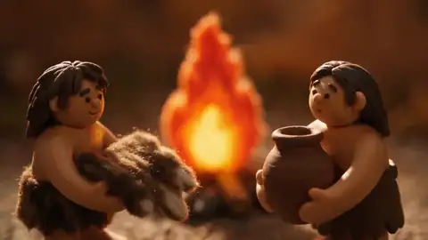

# 儿童科普动画

**模式**：文生视频 | **时长**：30s | **画幅**：16:9

风格化插画配合旁白逐句展开。重点在于风格描述要具体到颜料和材质，否则容易滑向廉价卡通。

| 岩彩长卷风格 | 黏土定格风格 |
|---|---|
|  |  |

## 需要的素材

无。

## 提示词

```text
儿童向丝路文化科普动画短片。敦煌壁画与长卷风格，岩彩平面动画，
矿物颜料质感，主色为赭石、绢白、石青、石绿、黛青、朱砂，金线点缀。
平面分层，长卷式流动构图。
不要真实摄影，不要 3D 写实，不要低龄化的圆头卡通。

内容重点是石榴的由来与传播，现代场景控制在 7 秒以内。

0-4s    一幅丝路长卷从左向右缓缓展开，枝头出现一颗轻轻晃动的石榴。
        口播：{你知道吗？我们今天常见的石榴，
        其实很早很早以前，来自中国西边很远的地方——西域。}

4-8s    一只手轻轻摘下石榴捧起，远山、纹样和道路在长卷中展开。
        口播：{一开始，它生长在阳光充足的土地上。
        后来，人们把它带上旅途，准备去更远的地方。}

8-15s   驼队带着石榴穿过沙漠、绿洲和城门，画面沿长卷持续横移。
        口播：{石榴跟着驼队慢慢往前走。一路上要穿过沙漠，经过绿洲，
        还要走过高高的城门。这条很长很长的路，就是古代有名的丝绸之路。}

15-20s  石榴随商旅进入更多城镇与生活场景，画面元素逐渐丰富。
        口播：{丝绸之路运送的不只有丝绸。很多远方的水果、香料和种子，
        也会沿着这条路来到新的地方。石榴就是这样，慢慢被更多人认识了。}

20-23s  石榴被切开，露出像红宝石一样的果粒，画面在此处停留。
        口播：{后来人们发现，石榴不仅好看，
        里面还藏着许多像红宝石一样的小果粒。}

23-27s  长卷中的古代场景慢慢过渡到今天，石榴出现在现代桌面上，
        一群小朋友围坐在一起分食。
        口播：{就这样，经过很长很长的传播，
        石榴从西域出发，最后走进了今天的生活。}

27-30s  枝头石榴、驼队、沙漠、绿洲、城门和今天桌上的石榴
        在同一幅长卷中汇合，镜头缓慢拉远呈现完整画卷，定格。
        口播：{所以，一颗小小的石榴，
        也藏着一段跨越土地和时间的旅行。}

画面始终保持平面分层的长卷感，镜头以横移和拉远为主，不做推近特写。
矿物颜料的颗粒感、绢本的纹理和金线的微光要清晰。

声音：(轻柔的丝竹配乐，音量低于口播) 口播为温和的女声，
语速缓慢，适合儿童理解。无音效。

不要字幕，不要现代插画风格，不要人物面部特写。
```

## 效果说明

儿童内容最容易翻车的是风格失控——写「儿童动画」模型会给你一坨圆头圆脑的廉价 3D。**解法是把风格描述具体到颜料名和工艺名**：「岩彩」「矿物颜料」「赭石石青石绿」「绢本纹理」，这些词比「儿童插画风」有效得多。

「现代场景控制在 7 秒以内」这种时长约束写在开头，模型会遵守。

## 改法

- **换主题**：茶叶、瓷器、造纸、火药都适用同一个「起源 → 传播 → 今天」结构
- **换风格**：
  - 绘本风 → `水彩绘本风格，柔和晕染，铅笔勾线，纸张纹理`
  - 剪纸风 → `中国剪纸动画风格，红色单色，镂空造型，平面分层`
  - 毛毡风 → `羊毛毡定格动画质感，绒毛纤维可见，手工感`
- **换语言**：口播换成目标语言，开头加 `口播语言：英语，语速缓慢清晰`
- **加字幕**：`口播同步显示中文字幕，位于画面下方，字体圆润`

## 相关

[运镜与光线词表：质感与风格](../../docs/06-camera-and-lighting.md#质感与风格)

在 [imya.ai](https://imya.ai/seedance-2-5) 直接试这条。
