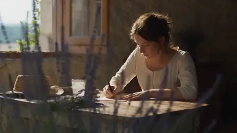
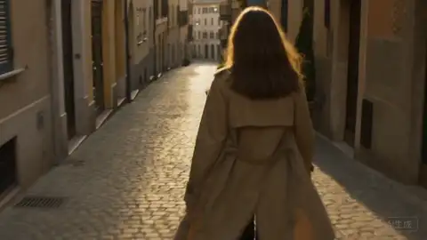
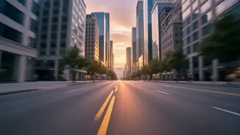

# 无对白叙事短片

**模式**：文生视频 | **时长**：30s | **画幅**：16:9

纯环境音、无台词的完整叙事段落。检验 30 秒直出能力最直接的一条——没有对白撑场，全靠画面推进和情绪连贯。



同类风格的画面参考——安静、克制、靠环境说话：

| | | |
|---|---|---|
|  |  |  |
|  |  |  |

## 需要的素材

无。

## 提示词

```text
一段 30 秒的无对白视觉故事，北欧海岸线的深秋清晨，冷灰调，纪录片式实拍质感。

0-6s   一位穿深蓝毛衣的老渔民独自坐在木质码头边缘，低头修补一张渔网，
       手指反复穿过破口。远处海面雾气未散，海鸟偶尔掠过。
       中景侧拍，浅景深，焦点在他的手上，背景的海是虚的。

6-16s  他停下手，抬头看向海面，视线停留了几秒。
       焦点从手部缓慢转移到远处海面，虚实反转。
       随后他放下渔网，撑着膝盖站起来，转身沿码头向岸边走。
       镜头由中景平移跟随，保持他在画面右侧三分之一处。

16-25s 他走过一排系着缆绳的空船位，每一个都空着。
       镜头继续跟随，前景不断掠过缆绳桩和锈迹斑斑的铁环。
       走到最后一个空船位时他停下，手扶在木桩上，向海面又看了一眼。

25-30s 镜头缓慢升起并后拉，人物在画面中逐渐变小，
       整条空荡的码头、灰白的海面和低垂的云层同时进入画面，定格。

画面呈现冷灰蓝色调，晨雾中的漫射光，无直射阳光，明暗对比柔和。
木头的潮湿质感、绳索的纤维、毛衣的织纹清晰可见。

声音：无背景音乐。只保留海浪轻拍码头桩的声音、绳索摩擦声、
海鸟的零星叫声、脚步踩在湿木板上的闷响，以及远处一声模糊的船笛。

不要字幕，不要慢动作，不要人物面向镜头，不要过度调色滤镜。
```

## 效果说明

一个完整的情绪弧线：专注 → 分神 → 起身 → 确认 → 空茫。全程没有一句台词，靠焦点转移、跟随镜头和空船位这个视觉线索完成叙事。收尾的升起后拉是 30 秒片子最稳妥的结束方式。

## 改法

- **换场景**：把「北欧海岸线／码头／渔网」整组替换即可，时间轴结构不用动
- **换情绪**：改 6-16s 的「视线停留」和 25-30s 的收尾方式。想要暖一点，把收尾改成有人从岸边走来
- **加对白**：在 16-25s 段落里加一句 `{...}`，但会破坏这条的无对白设定，建议另开一条
- **缩到 15s**：删掉 16-25s 整段，把 6-16s 压到 6-10s

## 相关

[提示词公式](../../docs/02-prompt-formula.md) · [运镜与光线词表](../../docs/06-camera-and-lighting.md)

在 [imya.ai](https://imya.ai/seedance-2-5) 直接试这条。
